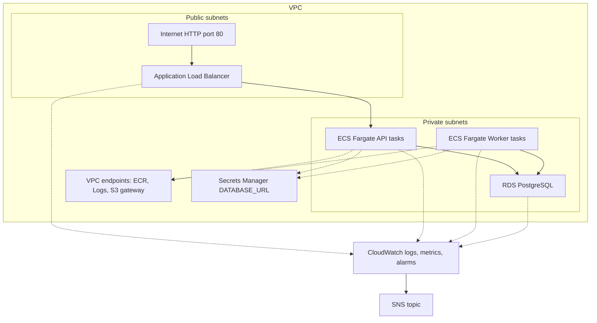
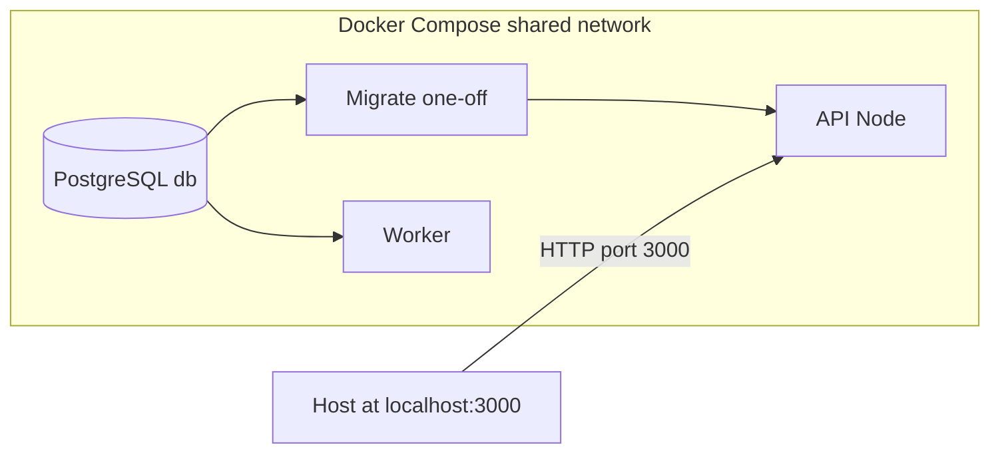
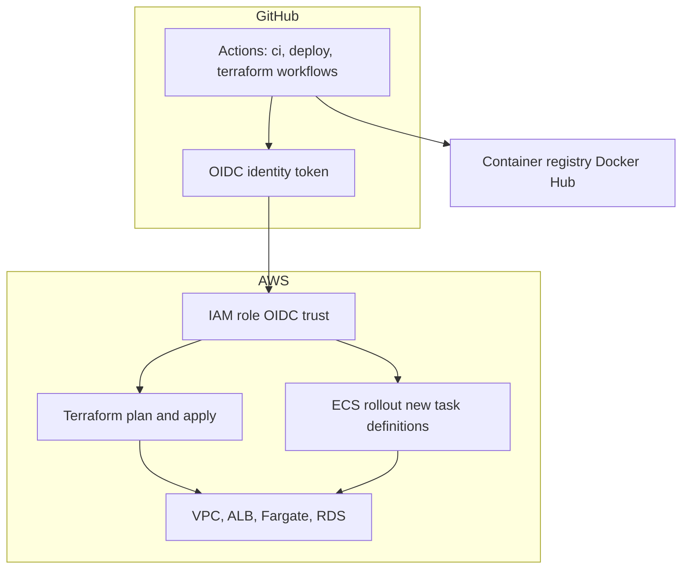

# cloud-native-deployment-platform

An end-to-end DevOps sample: a small HTTP API and background worker backed by PostgreSQL, packaged in Docker, deployed to AWS with ECS Fargate and an Application Load Balancer, managed by Terraform, and checked by GitHub Actions.

This file is the map of the repo. For depth, follow the links below.

## Operational automation

This project is more than an ECS deployment demo. It includes operator-facing automation for drift checks and incident evidence collection.

- Terraform drift detector: [`scripts/terraform_drift_report.py`](scripts/terraform_drift_report.py) runs `terraform plan -detailed-exitcode -json`, filters the noisy plan stream, and turns creates, updates, replacements, and deletes into a short report. [`.github/workflows/terraform-drift-report.yml`](.github/workflows/terraform-drift-report.yml) runs it on weekday mornings and on demand, writes to the GitHub Actions job summary, and uploads the report artifact.
- Incident log pull: [`scripts/incident_log_report.py`](scripts/incident_log_report.py) pulls CloudWatch Logs for a requested time window, classifies events as `ERROR`, `WARN`, `INFO`, or `UNKNOWN`, and emits Markdown or JSON for post-incident review. [`.github/workflows/incident-log-report.yml`](.github/workflows/incident-log-report.yml) runs it manually through a least-privilege OIDC role created by Terraform.
- Deploy health checks: [`scripts/health_check.py`](scripts/health_check.py) checks ALB liveness, `/health`, ECS service capacity, recent deployment events, stopped-task reasons, and recent CloudWatch error signals after Terraform apply.

## Testing strategy

The test suite focuses on behavior at service boundaries, not just isolated implementation details. CI runs these checks before publishing Docker images or planning infrastructure changes.

- API contract tests: 14 Node test cases in [`app/test/app.test.js`](app/test/app.test.js) use `supertest` against the Express app with a fake in-memory repository. They cover health/readiness, deployment creation, request trimming, validation failures, list/filter behavior, lookup and 404 behavior, status updates, invalid transitions, deletes, invalid IDs, and generic error responses.
- Worker lifecycle tests: 5 Node test cases in [`worker/test/worker.test.js`](worker/test/worker.test.js) exercise the async deployment state machine directly. They assert that `pending` work is claimed as `running` before completion, deterministic random inputs produce both `succeeded` and `failed` outcomes, empty polls do no work, processing delays are honored, and repository startup retries until ready.
- Infrastructure tests: 5 Terraform module test files under [`infra/modules/`](infra/modules/) validate network, ALB, ECS cluster, ECS service, and RDS module behavior. The Terraform Plan workflow also runs `terraform fmt`, `terraform validate`, `tflint`, and `tfsec`.
- Operator script tests: 8 Python unit tests cover Terraform drift parsing, migration ordering, idempotent skips, and rollback behavior. [`scripts-lint.yml`](.github/workflows/scripts-lint.yml) runs those tests, Pylint, and a real PostgreSQL migration replay to verify cold-start and idempotent behavior. Docker CI starts the built API image and runs [`scripts/health_check.py`](scripts/health_check.py) against `localhost:3000`.

## Architecture

> Warning: this demo runs HTTP-only by default to avoid ACM and Route53 setup. Set `alb_certificate_arn` to enable TLS.

Production on AWS: Terraform-managed VPC, internet-facing ALB to ECS Fargate API, a private worker service, RDS PostgreSQL, VPC endpoints for ECR, Logs, and S3, Secrets Manager for `DATABASE_URL`, and CloudWatch to SNS for operational alarms. When `alb_certificate_arn` is set to a validated ACM certificate in the ALB region, Terraform adds an HTTPS `:443` listener and an HTTP to HTTPS redirect.

Local development: Docker Compose runs Postgres, a one-off migrate service, the API on port `3000`, and the worker on a shared network ([`docker/docker-compose.yml`](docker/docker-compose.yml)).

CI/CD: GitHub Actions builds and pushes API and worker images to the registry, then uses OIDC to assume an IAM role and run Terraform and ECS rollouts without long-lived AWS keys in GitHub.

## Decisions

These choices are not automatic wins. They are the tradeoffs this sample makes.

- ECS Fargate plus an ALB is more infrastructure than a tiny API needs. A single VM, App Runner, or even Compose on one host would be easier to explain and cheaper to operate. I still like Fargate here because the point is to show the shape of a production-ish service: private tasks, public entry point, health checks, rollout behavior, logs, and IAM boundaries. The cost is that the sample asks you to understand more AWS surface area before you see a response from `/health`.
- Managed RDS plus Secrets Manager is heavier than bundling Postgres into the app stack. For a demo, that can feel self-important. The reason to keep it is that persistence is where toy platforms usually lie. A managed database, private subnet placement, and injected connection string make failures and responsibilities clearer. The doubt I have is around cost and cleanup. If I were using this only for local learning, Compose would be the better path.
- GitHub Actions OIDC plus Terraform automation is safer than pasting AWS keys into secrets, but it is not simpler. There are more moving parts: IAM trust policies, repository variables, workflow inputs, and environment-specific state. I accept that complexity because deployment automation should teach the boring secure default. The catch is that a broken trust policy can look like a broken deploy, so the docs have to stay blunt about setup.

## What lives where

| Part | Role | Docs |
|------|------|------|
| [`app/`](app/) | Express API: health, deployments CRUD, readiness. | [`app/README.md`](app/README.md) · [`app/test/README.md`](app/test/README.md) |
| [`worker/`](worker/) | Polls DB and moves deployments from pending through running to succeeded or failed. | [`worker/README.md`](worker/README.md) |
| [`migrations/`](migrations/) | Numbered SQL migrations. | Applied via [`scripts/run_migrations.py`](scripts/run_migrations.py); see [`scripts/README.md`](scripts/README.md) and [`docker/README.md`](docker/README.md). |
| [`docker/`](docker/) | Docker Compose: Postgres, migrations, API, worker. | [`docker/README.md`](docker/README.md) |
| [`infra/`](infra/) | Terraform: VPC, ECS Fargate, ALB, OIDC-friendly IAM, CloudWatch alarms, and SNS for ops. | [`infra/README.md`](infra/README.md) |
| [`scripts/`](scripts/) | Python helpers: drift report, migrations runner, deploy health check, incident log pull. | [`scripts/README.md`](scripts/README.md) |
| [`.github/workflows/`](.github/workflows/) | CI/CD: image build, Terraform plan/apply/destroy, drift report, script lint, incident reports, and related automation. | Open the YAML files for triggers and inputs. |

## End-to-end flow (high level)

1. Develop the API and worker; tests run in CI.
2. CI builds and pushes API and worker container images. Terraform, either manually or through workflows, rolls the API behind an ALB and runs the worker as a private ECS service.
3. CloudWatch collects logs and can raise alarms for ALB 5xx, ECS capacity, and RDS storage or CPU on an SNS topic. Scripts can smoke-test the ALB, check ECS, scan recent logs, or summarize Terraform drift.
4. Locally, Compose brings up DB, migrate, API, and worker so you can work without AWS.

Production path: ECS Fargate plus ALB, managed by Terraform.

## GitHub Actions and AWS (OIDC)

Workflows assume an IAM role via OIDC, so GitHub does not need long-lived AWS access keys.

Typical variables:

- `AWS_ROLE_TO_ASSUME`: ARN for the main deploy/infrastructure role
- `TF_INFRA_ENVIRONMENT`: `dev` or `prod`; selects `infra/envs/<name>/` for Terraform `-backend-config` and `-var-file` in CI. If the repository variable is missing or empty, workflows coerce it to `dev` (`vars.TF_INFRA_ENVIRONMENT || 'dev'`); shell steps also use `dev` via `${TF_INFRA_ENVIRONMENT:-dev}`.
- `TF_AWS_REGION`: e.g. `eu-north-1`
- Container images for Terraform in CI: plan/apply/drift/destroy resolve `TF_VAR_docker_image` and `TF_VAR_worker_image` automatically from the latest successful [`ci.yml`](.github/workflows/ci.yml) run on `main`, using the same Git SHA tagging as deploy and `DOCKERHUB_USERNAME`. You do not need `TF_DOCKER_IMAGE` or `TF_WORKER_IMAGE` variables.
- `TF_ENABLE_ECS`: `true` for Fargate

Secrets:

- `TF_DATABASE_URL_SECRET_ARN`: optional ARN of an existing AWS Secrets Manager `DATABASE_URL` secret; leave unset when Terraform creates RDS
- `DOCKERHUB_USERNAME` / `DOCKERHUB_TOKEN`: Docker Hub login for building and pushing the API and worker images (see [`ci.yml`](.github/workflows/ci.yml))

Optional incident log workflow: set `AWS_INCIDENT_LOGS_READER_ROLE_ARN` from Terraform output `github_actions_incident_logs_reader_role_arn` for the same environment Terraform provisions. Roles are scoped by `environment` in app tags. See [`infra/README.md`](infra/README.md).

The IAM trust policy for `AWS_ROLE_TO_ASSUME` must allow `token.actions.githubusercontent.com` for your repository. If you use [`infra/aws-oidc-role-trust-policy.json`](infra/aws-oidc-role-trust-policy.json) as a starting point, replace the example AWS account ID `123456789012` before creating the role.

## Related documentation

- Operations runbook: [`docs/RUNBOOK.md`](docs/RUNBOOK.md)
- Bootstrap and drift: [`infra/README.md`](infra/README.md)
- Local full stack: [`docker/README.md`](docker/README.md)
- Operator and automation scripts: [`scripts/README.md`](scripts/README.md)
