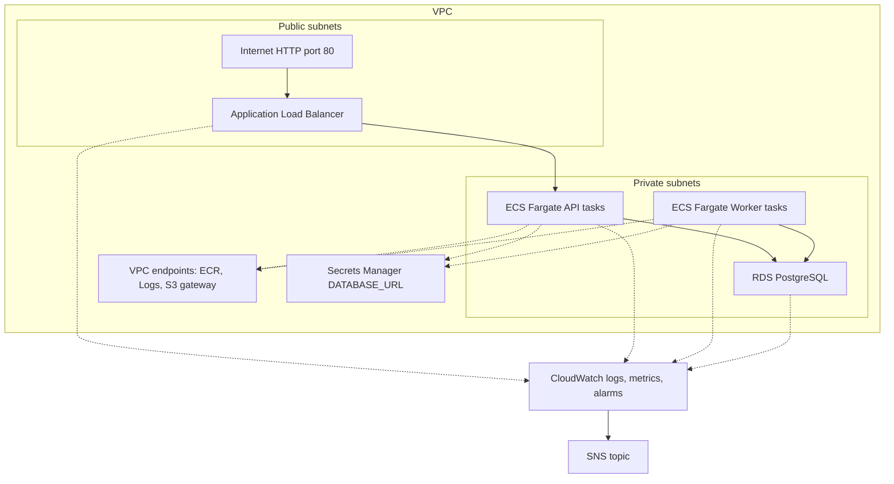
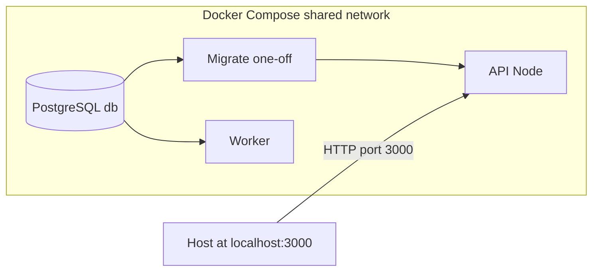
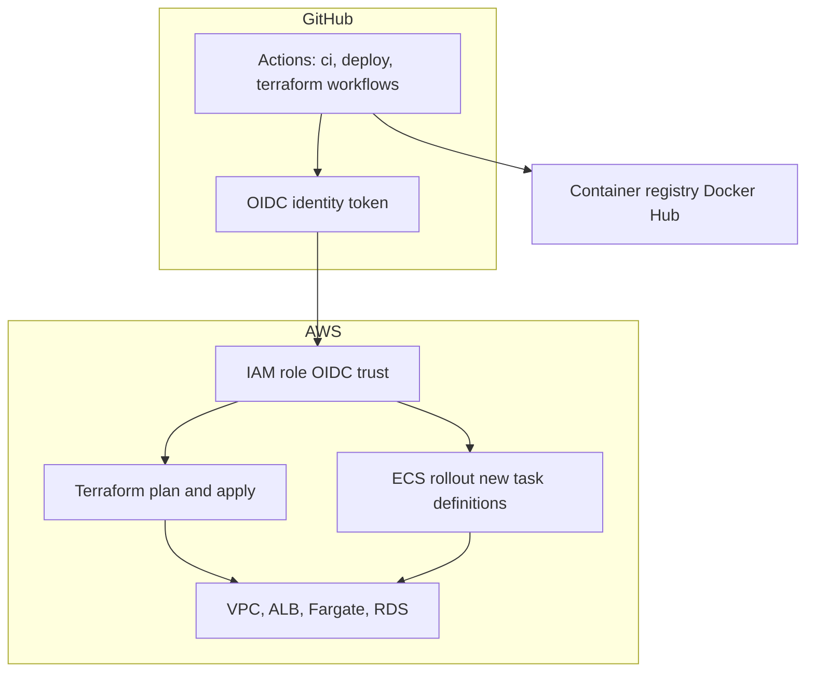

# cloud-native-deployment-platform

An end-to-end **DevOps sample**: a small **HTTP API** and **background worker** backed by **PostgreSQL**, packaged in **Docker**, deployed to **AWS** (ECS Fargate + load balancer) with **Terraform**, and validated by **GitHub Actions**.

This file is the **map of the repo**. For depth, follow the links below.

## Operational automation

This project is more than an ECS deployment demo: it includes operator-focused automation for detecting infrastructure drift and pulling incident evidence from AWS.

- **Terraform drift detector:** [`scripts/terraform_drift_report.py`](scripts/terraform_drift_report.py) runs `terraform plan -detailed-exitcode -json`, filters the noisy plan stream, and turns creates/updates/replacements/deletes into a short human-readable report. [`.github/workflows/terraform-drift-report.yml`](.github/workflows/terraform-drift-report.yml) runs it on weekday mornings and on demand, writes the result to the GitHub Actions job summary, and uploads the report artifact.
- **Incident log pull:** [`scripts/incident_log_report.py`](scripts/incident_log_report.py) pulls CloudWatch Logs over a requested time window, classifies events as `ERROR`, `WARN`, `INFO`, or `UNKNOWN`, and emits Markdown or JSON for post-incident review. [`.github/workflows/incident-log-report.yml`](.github/workflows/incident-log-report.yml) runs it manually through a least-privilege OIDC role created by Terraform.
- **Deploy health checks:** [`scripts/health_check.py`](scripts/health_check.py) checks ALB liveness, `/health`, ECS service capacity, recent deployment events, stopped-task reasons, and recent CloudWatch error signals after Terraform apply.

## Testing strategy

The test suite focuses on behavior at service boundaries instead of only isolated implementation details. CI runs these checks before publishing Docker images or planning infrastructure changes.

- **API contract tests:** 9 Node test cases in [`app/test/app.test.js`](app/test/app.test.js) use `supertest` against the Express app with a fake in-memory repository. They cover health/readiness, deployment creation, request trimming, validation failures, list/filter behavior, lookup/404 behavior, status updates, invalid transitions, and deletes.
- **Worker lifecycle tests:** 2 Node test cases in [`worker/test/worker.test.js`](worker/test/worker.test.js) exercise the async deployment state machine directly. They assert that `pending` work is claimed as `running` before completion, and that deterministic random inputs produce both `succeeded` and `failed` outcomes.
- **Infrastructure tests:** 5 Terraform module test files under [`infra/modules/`](infra/modules/) validate network, ALB, ECS cluster, ECS service, and RDS module behavior. The Terraform Plan workflow also runs `terraform fmt`, `terraform validate`, `tflint`, and `tfsec`.
- **Operational smoke tests:** [`scripts-lint.yml`](.github/workflows/scripts-lint.yml) runs Pylint on Python operator scripts and replays migrations twice against a real PostgreSQL service to verify cold-start and idempotent behavior. Docker CI starts the built API image and runs [`scripts/health_check.py`](scripts/health_check.py) against `localhost:3000`.

## Architecture

> ⚠️ This demo runs HTTP-only by default to avoid ACM/Route53 setup. Set `alb_certificate_arn` to enable TLS.

**Production (AWS):** Terraform-managed VPC, Internet-facing **ALB → ECS Fargate API** and a **private worker** service, **RDS PostgreSQL**, **VPC endpoints** (ECR, Logs, S3), **Secrets Manager** for `DATABASE_URL`, and **CloudWatch → SNS** for operational alarms. When **`alb_certificate_arn`** is set to a validated **ACM** certificate in the ALB region, Terraform adds an **HTTPS :443** listener and **HTTP→HTTPS** redirect.

**Local development:** **Docker Compose** runs Postgres, a one-off **migrate** service, the **API** (published on port **3000**), and the **worker** on a shared network ([`docker/docker-compose.yml`](docker/docker-compose.yml)).

**CI/CD:** **GitHub Actions** builds and pushes API and worker images to the registry, then uses **OIDC** to assume an **IAM role** and run **Terraform** / **ECS** rollouts without long-lived AWS keys in GitHub.

## What lives where

| Part | Role | Docs |
|------|------|------|
| **[`app/`](app/)** | Express API (health, deployments CRUD, readiness). | [`app/README.md`](app/README.md) · [`app/test/README.md`](app/test/README.md) |
| **[`worker/`](worker/)** | Polls DB; moves deployments from pending through running to succeeded/failed (demo lifecycle). | [`worker/README.md`](worker/README.md) |
| **[`migrations/`](migrations/)** | Numbered SQL migrations. | Applied via [`scripts/run_migrations.py`](scripts/run_migrations.py); see [`scripts/README.md`](scripts/README.md) and [`docker/README.md`](docker/README.md). |
| **[`docker/`](docker/)** | Docker Compose: Postgres, migrations, API, worker. | [`docker/README.md`](docker/README.md) |
| **[`infra/`](infra/)** | Terraform: VPC, ECS Fargate, ALB, OIDC-friendly IAM, **CloudWatch alarms + SNS** for ops. | [`infra/README.md`](infra/README.md) |
| **[`scripts/`](scripts/)** | Python helpers: drift report, migrations runner, deploy health check, incident log pull. | [`scripts/README.md`](scripts/README.md) |
| **[`.github/workflows/`](.github/workflows/)** | CI/CD: image build, Terraform plan/apply/destroy, drift report, script lint, incident reports, etc. | Open the YAML files for triggers and inputs. |

## End-to-end flow (high level)

1. **Develop** the API and worker; **tests** run in CI.
2. **CI** builds and pushes API and worker container images; **Terraform** (manually or via workflows) rolls the API behind an **ALB** and runs the worker as a private ECS service.
3. **CloudWatch** collects logs and can raise **alarms** (ALB 5xx, ECS capacity, RDS storage/CPU) on an **SNS topic** for notifications; **scripts** can smoke-test the ALB, check ECS, scan recent logs, or summarize Terraform drift.
4. **Locally**, **Compose** brings up DB + migrate + API + worker so you can work without AWS.

**Production path:** ECS Fargate + ALB (Terraform).

## GitHub Actions and AWS (OIDC)

Workflows assume an IAM role via **OIDC**—no long-lived AWS access keys stored in GitHub.

**Variables** (typical):

- `AWS_ROLE_TO_ASSUME` — ARN for the main deploy/infrastructure role
- `TF_INFRA_ENVIRONMENT` — `dev` or `prod`; selects `infra/envs/<name>/` for Terraform **`-backend-config`** and **`-var-file`** in CI. If the repository variable is missing or empty, workflows coerce it to **`dev`** (`vars.TF_INFRA_ENVIRONMENT || 'dev'`); shell steps also use **`dev`** via `${TF_INFRA_ENVIRONMENT:-dev}`.
- `TF_AWS_REGION` — e.g. `eu-north-1`
- **Container images for Terraform in CI** — plan/apply/drift/destroy resolve `TF_VAR_docker_image` / `TF_VAR_worker_image` automatically from the **latest successful [`ci.yml`](.github/workflows/ci.yml) run on `main`** (same **Git SHA** tagging as deploy) using `DOCKERHUB_USERNAME`; you do not need `TF_DOCKER_IMAGE` / `TF_WORKER_IMAGE` variables
- `TF_ENABLE_ECS` — `true` for Fargate

**Secrets:**

- `TF_DATABASE_URL_SECRET_ARN` — optional ARN of an existing AWS Secrets Manager `DATABASE_URL` secret; leave unset when Terraform creates RDS
- `DOCKERHUB_USERNAME` / `DOCKERHUB_TOKEN` — Docker Hub login for building and pushing the API and worker images (see [`ci.yml`](.github/workflows/ci.yml))

**Optional (incident log workflow):** set **`AWS_INCIDENT_LOGS_READER_ROLE_ARN`** from Terraform output `github_actions_incident_logs_reader_role_arn` for the **same** environment Terraform provisions (roles are scoped by `environment` in app tags). See [`infra/README.md`](infra/README.md).

The IAM **trust policy** for `AWS_ROLE_TO_ASSUME` must allow `token.actions.githubusercontent.com` for your repository. If you use [`infra/aws-oidc-role-trust-policy.json`](infra/aws-oidc-role-trust-policy.json) as a starting point, replace the example AWS account ID `123456789012` before creating the role.

## Related documentation

- **Operations runbook:** [`docs/RUNBOOK.md`](docs/RUNBOOK.md)
- **Bootstrap and drift:** [`infra/README.md`](infra/README.md)
- **Local full stack:** [`docker/README.md`](docker/README.md)
- **Operator / automation scripts:** [`scripts/README.md`](scripts/README.md)
